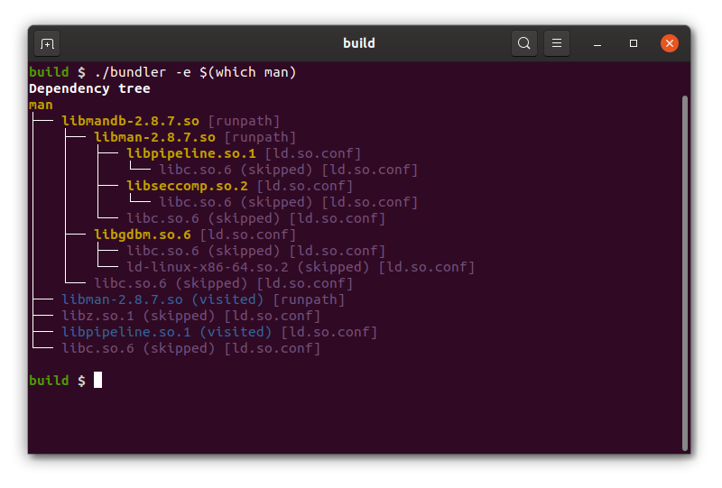

[](https://aur.archlinux.org/packages/libtree/)

# libtree

A tool that:
- :deciduous_tree: turns `ldd` into a tree
- :point_up: explains why shared libraries are found and why not
- :package: optionally deploys executables and dependencies into a single directory



## Installation
Download the [**latest release**](https://github.com/haampie/libtree/releases) from GitHub.

**Static executable**

```bash
wget -qO libtree https://github.com/haampie/libtree/releases/download/v2.0.0/libtree_x86_64
chmod +x libtree
./libtree $(which man)
```

**Static executable + optional dependencies**

```bash
wget -qO libtree.tar.gz https://github.com/haampie/libtree/releases/download/v2.0.0/libtree_x86_64.tar.gz
mkdir libtree
tar -xf libtree.tar.gz -C libtree
export PATH="$PWD/libtree:$PATH"
libtree $(which man)
```

## Deploying binaries + dependencies into a folder
```bash
$ libtree $(which man) -d man.bundle --chrpath --strip
man
├── libmandb-2.9.1.so [runpath]
│   ├── libman-2.9.1.so [runpath]
│   │   ├── libpipeline.so.1 [ld.so.conf]
│   │   └── libseccomp.so.2 [ld.so.conf]
│   └── libgdbm.so.6 [ld.so.conf]
├── libman-2.9.1.so (collapsed) [runpath]
└── libpipeline.so.1 (collapsed) [ld.so.conf]

Deploying to "man.bundle/usr"
"/usr/bin/man" => "man.bundle/usr/bin/man"
"/usr/lib/man-db/libmandb-2.9.1.so" => "man.bundle/usr/lib/libmandb-2.9.1.so"
"/usr/lib/man-db/libman-2.9.1.so" => "man.bundle/usr/lib/libman-2.9.1.so"
"/usr/lib/x86_64-linux-gnu/libpipeline.so.1.5.2" => "man.bundle/usr/lib/libpipeline.so.1.5.2"
  creating symlink "man.bundle/usr/lib/libpipeline.so.1"
"/usr/lib/x86_64-linux-gnu/libseccomp.so.2.5.1" => "man.bundle/usr/lib/libseccomp.so.2.5.1"
  creating symlink "man.bundle/usr/lib/libseccomp.so.2"
"/usr/lib/x86_64-linux-gnu/libgdbm.so.6.0.0" => "man.bundle/usr/lib/libgdbm.so.6.0.0"
  creating symlink "man.bundle/usr/lib/libgdbm.so.6"

$ tree man.bundle/
man.bundle/
└── usr
    ├── bin
    │   └── man
    └── lib
        ├── libgdbm.so.6 -> libgdbm.so.6.0.0
        ├── libgdbm.so.6.0.0
        ├── libman-2.9.1.so
        ├── libmandb-2.9.1.so
        ├── libpipeline.so.1 -> libpipeline.so.1.5.2
        ├── libpipeline.so.1.5.2
        ├── libseccomp.so.2 -> libseccomp.so.2.5.1
        └── libseccomp.so.2.5.1

3 directories, 9 files
```

## Verbose output
By default, certain standard dependencies are not shown. For more verbose output use
-  `libtree -v $(which man)` to show skipped libraries without their children
-  `libtree -a $(which apt-get)` to show the full recursive list of libraries

Use the `--path` or `-p` flags to show paths rather than sonames:

- `libtree -p $(which tar)`

## Changing search paths
`libtree` follows the rules of `ld.so` to locate libraries, but does not use `ldconfig`'s
cache. Instead it parses `/etc/ld.so.conf` at runtime. In fact you can change the search
path config by setting `--ldconf mylibs.conf`. Search paths can be added as well via 
`LD_LIBRARY_PATH="path1:path2:$LD_LIBRARY_PATH" libtree ...`.

## Building
- **From source**:
  ```bash
  git clone https://github.com/haampie/libtree.git
  cd libtree
  mkdir build
  cd build
  cmake -DCMAKE_BUILD_TYPE=Release -DCMAKE_PREFIX_PATH="/path/to/cxxopts;/path/to/elfio;/path/to/termcolor" ..
  make -j
  make install
  ```
- **Using [spack](https://github.com/spack/spack)**:
  ```
  spack install libtree +chrpath +strip
  spack load libtree
  ```

## Known issues
- When deploying libs with `libtree app -d folder.bundle --chrpath`, the runpaths are only
  changed when the binaries already have an rpath or runpath. This is a limitation of
  `chrpath`. Another option is to use `patchelf` instead, but this tool is known to break
  binaries sometimes.
